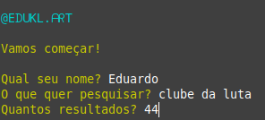
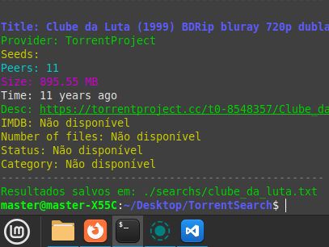
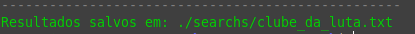
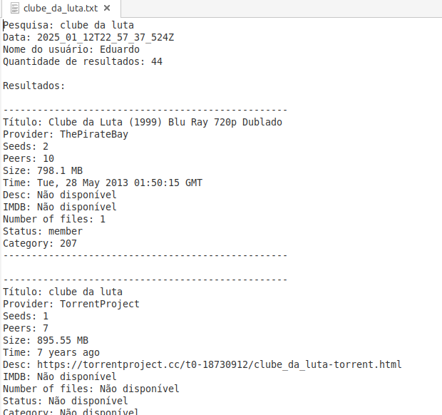

# TorrentSearch

## Descrição

Projeto criado com o objetivo de facilitar e tornar mais seguro a pesquisa de torrents, já que normalmente precisamos pesquisar no navegador e a possibilidade de encontrar um site clone e inseguro é muito alta. Este projeto reduz esse risco, conectando você a sites oficiais e seguros de torrents. Assim, você não precisará mais sair em busca de sites de torrents.

## Status


## Tecnologias Usadas
- Node.js
- **Chalk** (Módulo Node.js)
- **Readline** (Módulo Node.js)
- **File System (fs)** (Módulo Node.js)

## Instalação
Siga os passos abaixo para instalar e configurar o projeto em sua máquina.

1. Clone o repositório:
   ```bash
   git clone <URL do repositório>
   ```

2. Navegue até o projeto:
   ```bash
   cd TorrentSearch
   ```

3. Instale as dependências e atualize:
   ```bash
   sudo apt update
   sudo apt upgrade
   sudo apt install node
   sudo apt install nodejs
   sudo npm install
   ```

## Como Usar

Após a instalação, para usar o projeto, basta rodar o comando abaixo dentro do diretório do projeto:

```bash
   npm start
```

## Exemplos

### Preenchendo os Inputs
Preencha os campos com sua pesquisa e o que deseja procurar. Após pressionar **Enter**, você receberá os resultados da pesquisa em poucos segundos. O terminal exibirá algo como:



### Resultados da Pesquisa
No terminal, serão exibidos todos os resultados da pesquisa. Mesmo que eu tenha printado apenas um exemplo, o programa mostrará mais resultados conforme a pesquisa realizada.



### Arquivo de Resultados
No final da pesquisa, você verá onde suas pesquisas foram salvas em um arquivo `.txt`.



### Visualizando e Editando os Resultados
Você pode visualizar o arquivo usando o seguinte comando:

```bash
cat nomedoarquivo.txt
```

Para abrir o arquivo em um editor, use:

```bash
nano nomedoarquivo.txt
```

Ou:

```bash
vim nomedoarquivo.txt
```

### Estrutura do Arquivo

Veja a estrutura do arquivo de resultados:



## Contribuindo

Se você deseja contribuir para o projeto, siga estas etapas:

1. Faça um fork deste repositório.
2. Crie uma branch para sua feature ou correção:
   ```bash
   git checkout -b minha-feature
   ```
3. Faça as alterações e commit:
   ```bash
   git commit -am 'Adiciona nova feature'
   ```
4. Envie para o repositório remoto:
   ```bash
   git push origin minha-feature
   ```
5. Abra um Pull Request no GitHub.

## Agradecimentos

Agradeço à biblioteca Node.js por fornecer tantas funcionalidades incríveis. Também sou grato ao Torrent e ao NPM por facilitarem tanto o desenvolvimento. Agradeço ainda a todos que visualizaram o projeto, compartilharam e contribuíram.

## Contato

- **Email**: [eduardo.santucci@proton.me](mailto:eduardo.santucci@proton.me)
- **Instagram**: [@edukl.art](https://www.instagram.com/edukl.art/profilecard/?igsh=MWtyc2VwYjlyM21qYg%3D%3D)
- **TikTok**: [@edukl.art](https://www.tiktok.com/@edukl.art?_t=ZM-8t0zg4xCBvx&_r=1)
- **Portfolio**: [eduklartdev.github.io](https://eduklartdev.github.io/pt/)
